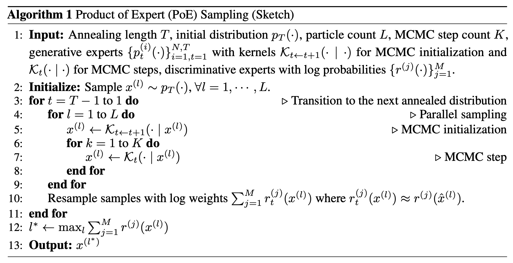

# An illustrated example of [Product of Experts for Visual Generation](https://arxiv.org/pdf/2506.08894) 


This repository features a simplified demo of the paper [Product of Experts for Visual Generation](https://arxiv.org/pdf/2506.08894) on a toy example of reconstructing a colored sphere. A blog-post breaking down the paper is coming soon, to the [Wayfarer Labs Blog](https://wayfarerlabs.ai/blog)!

*Paper Authors:* [Yunzhi Zhang](https://cs.stanford.edu/~yzzhang/)<sup>1</sup>, [Carson Murtuza-Lanier](https://profiles.stanford.edu/carson-murtuza-lanier)<sup>1</sup>, [Zizhang Li](https://kyleleey.github.io/)<sup>1</sup>, [Yilun Du](https://yilundu.github.io/)<sup>2</sup>, [Jiajun Wu](https://jiajunwu.com/)<sup>1</sup>

<sup>1</sup> *Stanford University*  
<sup>2</sup> *Harvard University*

For this toy setting, each individual generative expert can either only flow 3D points across 1 axis, or only flow the color of the points towards one of three modes that make up the RGB distribution of a sampled sphere. Sampling from such a flow model, we can see that each sphere has Saturn-ring like artifacts; points on the initial unit Gaussian that are on the correct location on only 1 of the 3 coordinates> See the GIF below (click it):


Using Annealed Importance Sampling, introduced in the [Product of Experts for Visual Generation](https://arxiv.org/pdf/2506.08894) paper, we can feasibly sample from the product of each generative expert's probability distribution to reconstruct the full sphere, as well as incorporate opaque discriminative experts (in this situation, color reward models) to guide the reconstruction of the sphere towards a color of our choosing (i.e.. Red, Green, or Blue). See the GIF below:


An interactive python notebook can be found in `demo.ipynb`. Each generative model is very small (512kb) and is stored directly in the repository, so no training is necessary.

For convenience, the annealed importance sampling algorithm from the paper is shown below. 



A code implementation of Annealed Importance Sampling can be found in `src/samplers.py`:

```python

@torch.no_grad()
def annealed_importance_sampling(
    generative_experts:     list[BaseFlowExpert | AnalyticExpert_Monochrome],
    discriminative_experts: list[DiscriminativeExpert_Color],
    n_particles:        int   = 2,
    n_points:           int   = 512,
    n_denoise_steps:    int   = 128,    # number of denoising steps for each expert (i.e. number of intermediate denoised distributions)
    n_seek_steps:       int   = 3,      # number of mcmc (langevin or gibbs) steps per intermediate denoised distribution
    step_size:          float = 1.,     # coefficient to adjust magnitude of flow ODE updates 
    kappa:              float = 0.05,   # step size of MCMC transition kernel
    return_trajectory:  bool  = True,   # whether to return all intermediate denoising steps for the purposes of visualization
) -> Tensor:
    for e in generative_experts + discriminative_experts: e.eval()

    log_w   = torch.zeros(n_particles)
    ts      = torch.linspace(1.0, 0.0, n_denoise_steps + 1)
    x       = torch.stack([sample_noise(n_points) for _ in range(n_particles)], dim=0)
    traj    = []

    # -- denoise over intermediate distributions (lines 3->11)
    for i in range(n_denoise_steps):
        t_hi, t_lo  = ts[i].item(), ts[i + 1].item()
        dt          = (t_lo - t_hi) / n_seek_steps
        # -- mcmc initialization (line 5)
        weights     = (1.                               for _    in generative_experts) # this is in case each expert is for a particular region in the scene
        velocities  = (e.calculate_velocity(x, t_hi)    for e    in generative_experts)
        x          += step_size * dt * sum(v*w          for v, w in zip(velocities, weights))

        for _ in range(n_seek_steps): # -- mcmc refinement (lines 6->8)
            velocities  = (e.calculate_velocity(x, t_hi) for e    in generative_experts)
            scores      = (_score(x, v, t_hi) * w        for v, w in zip(velocities, weights))
            x          += (kappa**2) / 2 * sum(scores)
            x          +=  kappa         * torch.randn_like(x)

        # -- reward experts (line 10)
        log_w           += sum(d.score(x).to(log_w) for d in discriminative_experts)
        should_resample  = discriminative_experts and _effective_sample_size(log_w) < (n_particles / 2)
        
        if should_resample:     x, log_w = _multinomial_resample(x, log_w)
        if return_trajectory:   traj    += [x[log_w.argmax()].clone().clamp(0, 1)]

    if return_trajectory:   return torch.stack(traj)
    else:                   return x[log_w.argmax()].clamp(0, 1)


def _effective_sample_size(log_w: Tensor) -> Tensor:
    # -- looks at the values of each particle, and counts
    # only the ones that still contribute. we use this to
    # determine when we should resample from a distribution
    # defined over these particles.
    return (w := torch.exp(log_w)).sum().square() / (w.square().sum() + 1e-8)

def _multinomial_resample(particles: Tensor, log_w: Tensor) -> tuple[Tensor, Tensor]:
    # -- resample particles based on their log weights.
    # -- this is the "importance sampling" in annealed importance sampling (AIS)
    # from the paper
    probs   = torch.softmax(log_w, dim=0)
    idx     = torch.multinomial(probs, num_samples=len(probs), replacement=True)
    return particles[idx], 0. * log_w[idx] 

def _score(x: Tensor, v: Tensor, t: Number) -> Tensor:
    # -- in rectified flows, alpha = t and sigma = (1-t)
    # -- we can use this to convert between velocity and score
    # with simple linear transformations :)
    alpha, sigma        = t, 1 - t
    deterministic_drift = (1/alpha) * x
    flow_contribution   = -(sigma * (sigma - alpha) / alpha**2) * v
    return deterministic_drift + flow_contribution

```
